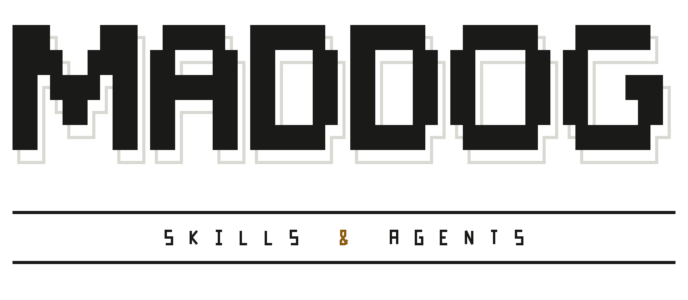

<p align="center">
  <picture>
    <source media="(prefers-color-scheme: dark)" srcset="assets/wordmark-dark.svg">
    
  </picture>
</p>

# maddog

Run your coding agent as an **organisation**, not an assistant.
maddog gives Claude Code a team: cheap hands for routine work, senior
judgment where it counts, and a pipeline that takes a feature from idea
to pull request.

## Install

```
/plugin marketplace add Harish-here/maddog
/plugin install maddog@maddog
```

Restart your session after installing.

Using another agent runtime? `npx skills add Harish-here/maddog` installs
the skills only.

## advisor-mode

The core of maddog. Start a session with a task:

```
/maddog:advisor-mode Add rate limiting to the public API
```

Claude becomes the advisor. It keeps the thinking: it plans the work,
hands each piece to the right team member, and checks what comes back
before calling it done.

Each piece goes to a team member by the judgment it needs, not by how hard
the topic sounds. A one-line config change in a complex system still goes
to the fast tier. You pay for strong models only where they change the
result.

| Team member | Takes on |
|---|---|
| `executor-fast-read` | Finding and quoting facts |
| `executor-fast` | Routine edits, test runs, git |
| `executor-smart` | Focused work that needs judgment |
| `executor-lead` | Multi-step work where each step depends on the last |
| `executor-judge` | An independent pass or fail, with no power to edit |

## Also in maddog

### product-engineering

```
/maddog:product-engineering Let users export their data as CSV
```

Takes one feature from idea to pull request. You approve a spec, a design
mockup, and a build plan. Then the feature is built, tested, and opened as
a pull request.

| Agent | Produces |
|---|---|
| `product-pm` | The product spec |
| `product-ux` | The user experience and a clickable mockup |
| `product-be` | The backend plan |
| `product-ui` | The frontend plan |
| `product-qa` | A verified build and the pull request (needs [Playwright MCP](https://github.com/microsoft/playwright-mcp)) |

`researcher` runs web searches for the pipeline and returns cited findings.

### More skills

| Skill | What it does |
|---|---|
| `section-by-section` | Reviews a skill or agent file with you, one section at a time |
| `efficient-md` | Keeps markdown files for agents and people short and well shaped |
| `plain-english` | Makes Claude's replies clear and direct |
| `mine-session` | Turns a working session into lessons for next time |

## Philosophy

Spend intelligence where it changes the outcome, give each agent only the
authority its job needs, and ask the human only for decisions that are
truly theirs. The full reasoning is in [PHILOSOPHY.md](PHILOSOPHY.md).

## Contributing

Changes land by pull request. See [CONTRIBUTING.md](CONTRIBUTING.md).

## License

MIT. See [LICENSE](LICENSE).
